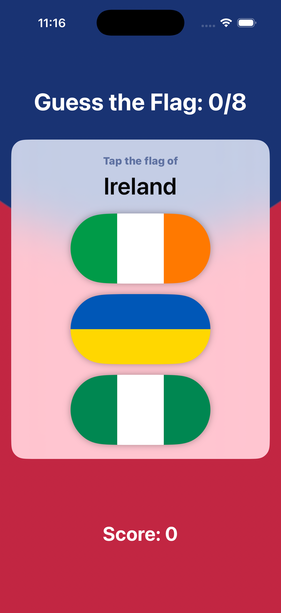

# GuessTheFlag 🚩

A fun, interactive iOS flag-guessing game built with **SwiftUI** as part of Paul Hudson's **100 Days of SwiftUI**.

Test your knowledge of world flags! GuessTheFlag presents three randomized flags and prompts the player to identify the correct country, tracking their score across an 8-round game with custom styling and haptic-friendly alerts.

---

## 📱 Preview

<p align="center">
  
</p>

---

## ✨ Features & Challenges Completed

- **Dynamic Question Generation**: Automatically selects 3 random country flags and picks one as the target answer.
- **Polished Visuals**:
  - Radial gradient background with rich color stops.
  - Frosted glass effect using `.regularMaterial` with rounded corners.
  - Flag images styled with capsule clip shapes and soft drop shadows.
- **Challenge 1 — Score Tracking**:
  - Live score counter displayed in the UI and updated in real-time.
  - Score reported dynamically in round alerts.
- **Challenge 2 — Helpful Feedback**:
  - When an incorrect flag is chosen, the alert tells the player exactly which flag they selected (e.g., *"Wrong! That’s the flag of France"*).
- **Challenge 3 — 8-Round Game & Restart**:
  - Game is capped at 8 questions with a live round counter (`0/8` to `8/8`).
  - Displays a dedicated **Game Over** alert judging the final performance.
  - **Restart** button resets the score, reshuffles flags, and begins a fresh game.

---

## 🛠 Tech Stack & Concepts

- **Language:** Swift 5.9+
- **Framework:** SwiftUI
- **Architecture:** Declarative UI with state-driven reactive design
- **Key Concepts:**
  - `@State` property wrappers for reactive state bindings (`score`, `questionCount`, `correctAnswer`, etc.)
  - Multiple `.alert` modifiers for per-round feedback and game-over flows
  - SwiftUI Layout & Visuals: `ZStack`, `VStack`, `RadialGradient`, `.regularMaterial`, `clipShape`, `shadow`
  - Randomized collections and Swift standard library methods (`shuffled()`, `random(in:)`)

---

## 🚀 Getting Started

### Prerequisites

- macOS Sonoma or later
- Xcode 15.0 or later
- iOS 17.0+ Simulator or physical device

### Installation

1. **Clone the repository:**
   ```bash
   git clone git@github.com:selva7378/GuessTheFlag.git
   cd GuessTheFlag
   ```

2. **Open the project in Xcode:**
   ```bash
   open GuessTheFlag.xcodeproj
   ```

3. **Run the App:**
   - Select your target simulator or connected iOS device in Xcode.
   - Press `Cmd + R` to build and run.

---

## 📂 Project Structure

```text
GuessTheFlag/
├── GuessTheFlag.xcodeproj         # Xcode project configuration
├── GuessTheFlag/                  # Source files
│   ├── GuessTheFlagApp.swift      # Application entry point (@main)
│   ├── ContentView.swift          # Main game view & game logic
│   └── Assets.xcassets            # App icons, colors, and country flag images
├── screenshots/                   # App screenshots for documentation
└── README.md                      # Project documentation
```

---

## 👤 Author

- **Selva Ganesh** - [GitHub](https://github.com/selva7378)
